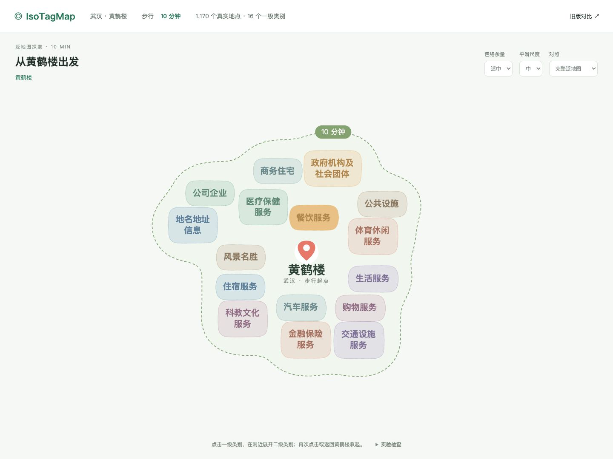

# 第89号报告：Stage88 黄鹤楼步行10分钟紧凑布局与平滑包络

本阶段的独立实验、回归检查和截图已完成。停在 10 分钟视觉确认，不自动推进 20/30 分钟或 Stage13.2B。

- 交互页：[hhl-10min-compact-envelope.html](exports/panmap-v2-gates/hhl-10min-compact-envelope.html)
- 对照页：[stage88-comparison.html](exports/panmap-v2-gates/stage88-comparison.html)
- 原 comparison.html 及其他旧实验未覆盖。
- 实验不启动主应用、不调用高德/ORS；只读取同目录 snapshot.json。CSP 限制连接来源为本站。

## 25 项执行回答

1. Snapshot：`exports/panmap-v2-gates/snapshot.json`，ID `panmap-173da623`；保存于 2026-09-10，目录 `amap-official-1.06-20230208-tree-v2`。
2. 10min POI：1170，分钟范围 1–10；本次无新查询、无数量与归属修改。
3. L1：16；数据中 L2 86、L3 169。初始仅16个 L1，餐饮展开增加9个 L2，不渲染L3/POI。
4. 默认初始及餐饮展开标签重叠均为0；16个一级类别分别展开的布局也检查为0。默认区域相叠0，时间边界包含所有类别区域。
5. 文字整体外接范围 258541.7 → 194750.3，缩小 24.67%；平均近邻间距 42.53 → 29.43，减少 30.81%。文字占有率 0.231 → 0.242。字体23→18、语义换行和布局共同作用，并非纯算法在相同字号下的提升。
6. 最大标签宽高比 6.81 → 2.89；7个长标签换行。优先在“服务/信息”及分隔符处换行，再使用均衡换行。
7. 保守径向范围指标 420.8 → 385.7，长文字拖尾减轻；整体外接框宽高比 1.090 → 1.157，这一项略增，不宣称全部形态指标均改善。
8. 仍为 bbox 采样→加权密度→可分离高斯卷积→d3.contours→最高有效阈值→轻度平滑。没有用预设时间曲线驱动文字。
9. 没有 convex hull。
10. 默认平滑尺度 medium=20；类别核带宽按0.3倍为6，时间包络按1.35倍为27。没有反复全局增大带宽掩盖细脖子。
11. 余量 tight/balanced/soft 为4/6/8；时间包络另加18，默认24。实际边界距离还受密度核和覆盖验证影响，参数值是保证的最小 bbox 余量。
12. 近邻桥接阈值78；只桥接近邻。类别采样按语义过滤，时间整体作为一个可达集合生成近邻支持。
13. 检测细脖子并拒绝不合格候选；最终默认初始及展开未触发 neck rejection。先做布局收紧、局部近邻支持，再搜索阈值，未执行不必要的局部 closing。
14. neckCount=0；minNeckWidth=null，含义是启发式没有找到符合定义的细脖子，不能解释为宽度0或数学证明不存在任意细窄结构。
15. 时间包络覆盖全部可见文字、中心安全区；默认还验证包含每个类别包络。
16. 默认轮廓自交检查通过；9组余量/尺度组合的时间包络覆盖与细脖子检查通过。
17. 中心真实坐标 114.296944, 30.546944；中心文字26px，大于一级18px；安全区142×100。1440与1134两视口展开、收起的中心像素漂移均0。
18. L1锚点不变；9个餐饮L2在父锚点附近按外向候选生成。最远子类别距父锚点 285 个布局单位，仍需要人工判断这一展开范围是否足够自然，不能把“局部”理解为完全没有外围扩张。
19. 默认餐饮展开，近邻最大让位 18.0，平均 3.375，远处节点0。
20. 再次点击或路径返回恢复基线坐标、范围和包络。使用320ms cubic-out动画；时间轮廓可扩大、可缩小，中心相机不随包络重新定位。
21. 10分钟标注附着在包络顶部轮廓点，随轮廓插值移动。两视口截图可见且未盖住类别文字。
22. Provider请求增量0。页面只读取本地静态快照；浏览器记录的远程或分析接口请求计数为0。
23. `../isoChroneSystem-before-stage88.bundle` 验证PASS。Bundle保存已有Git历史；原工作树差异另存临时patch，原修改保留。
24. 中期GitHub备份完成：`backup/stage88-hhl10min-core-20260911`，提交 `f9ceb0f`。
25. 最终GitHub备份已完成：`backup/stage88-hhl10min-final-20260911`，实验提交 `049e870`；核验记录见 `artifacts/stage88/git-backup.json`。

## 性能与验收边界

最终浏览器记录：布局最高 10.9ms；包络生成最高 82.8ms。包络首次计算未达到<50ms目标；缓存后的收起/重复展开接近0ms。数值来自页面公开的实验检查面板，见 browser-evidence.json。

自动检查覆盖分类树、零文字重叠、固定中心、16个L1锚点、局部展开、远处上下文、收起恢复、时间覆盖、默认区域相叠、自交、确定性及参数组合。旧版 v2 的7项回归测试通过。本阶段没有重新跑与此次独立页面无关的后端Provider用例。

“中心明确、内侧受压、外侧圆润、成块、不过度贴边”的主观验收保留给人工。本次类别边界由各可见类别文本生成，尚未做共享边界联解；不将本实验描述为最终多层地域分区完成版。全局宽高比略增、首次包络超时、餐饮L2展开范围是重点观察项。

## 证据与复现

- `node scripts/audit_stage88.cjs`
- `node --test src/panmap-v2/panmap-v2.test.js`
- `python3 scripts/report_stage88.py`（根据已保存浏览器证据生成报告，不请求Provider）
- `artifacts/stage88/data-audit.json`、`layout-compactness.json`、`center-audit.json`、`geometry-tests.json`、`region-audit.json`、`expansion-audit.json`、`parameter-variants.json`。
- 13张真实PNG：前10张1440×1080，另3张1134×959。07/08是同一稳定状态的两项验收记录，不伪称不同布局。

