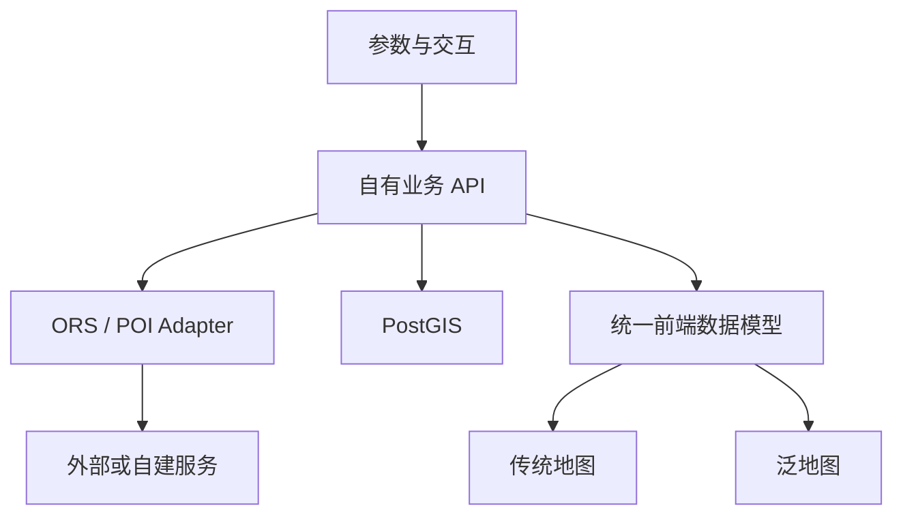

# ORS 地图服务重构：Codex 执行文档（第 1 阶段）

> 文档用途：把本文件放入项目代码仓库根目录，交给 Codex 按顺序执行。  
> 本阶段名称：现状盘点与架构基线。  
> 本阶段只做检查、设计和必要的文档落地，不接入 ORS、不修改现有地图界面、不创建数据库。

---

## 1. 项目目标

本项目需要逐步完成以下改造：

1. 保留现有“泛地图”作为主要研究视图，不把项目改造成导航或路径规划系统。
2. 将传统地图视图的地图内核逐步替换为可独立控制的开源 WebGIS 前端。
3. 通过自有后端统一调用 openrouteservice（ORS）的可达域、通行时间矩阵等服务。
4. 通过统一 POI 服务获取、标准化、存储和查询 POI。
5. 使用 PostgreSQL + PostGIS 保存 POI、等时圈、分析任务及空间关系。
6. 让传统地图与泛地图共享同一份分析数据和交互状态，实现 POI、类别、圈层的双向联动。
7. 后续能够在不重写前端的情况下，将公共 ORS、公共 POI 服务替换为自建服务。

本项目的目标架构是：

```text
前端应用
├── 传统地图视图：MapLibre GL JS（目标选型）
├── 泛地图视图：保留现有 D3 / SVG / Canvas 实现
└── 统一交互状态：中心点、圈层、类别、POI、选中与高亮
        │
        ▼
自有业务后端
├── Analysis API
├── Isochrone Service
├── Travel Time Service
├── POI Service
├── ORS Adapter
└── POI Provider Adapter
        │
        ├── PostgreSQL + PostGIS
        ├── Redis（后续按需加入）
        ├── ORS 公共服务 / 自建 ORS
        └── 公共 POI 服务 / 自建 POI 数据库
```

---

## 2. 已确定的架构原则

执行过程中不得擅自改变以下原则。

### 2.1 前端不直接调用 ORS

前端只调用项目自己的后端 API。ORS API Key 不得进入前端代码、浏览器请求、提交记录或示例截图。

正确调用关系：

```text
前端 → 自有后端 → ORS / POI 数据源
```

### 2.2 ORS 是可替换的服务提供者

ORS 负责可达域、矩阵等路网计算，但不能让 ORS 返回结构直接渗透到整个前端。后端必须通过 Adapter 转换为项目内部数据模型。

### 2.3 PostGIS 是后续的空间数据中心

正式版本中的多边形有效性修复、等时圈差集、空间索引、POI 范围查询和圈层归属应由 PostGIS 承担。Turf.js 只用于少量前端预览或轻量即时计算。

### 2.4 数据状态与视觉状态分离

以下属于数据状态：

- 中心点；
- 交通方式；
- 时间范围；
- 累积等时圈；
- 互斥圈层；
- POI；
- POI 类别树；
- POI 通行时间；
- POI 圈层归属。

以下属于视觉或交互状态：

- POI 颜色、大小、透明度；
- 等时圈颜色、描边、透明度；
- 当前高亮 POI；
- 当前聚焦圈层；
- 当前展开的类别路径；
- 父子包络的显示状态。

只改变视觉或交互状态时，不得重新请求 ORS。

### 2.5 传统地图与泛地图不直接互相调用

两个视图通过统一状态中心和稳定的 `poiId`、`ringId`、`categoryId` 联动，不在组件之间建立相互控制的函数链。

### 2.6 本次不是整体重写

优先采用渐进迁移：

- 保留可以继续使用的泛地图算法与界面；
- 为现有代码增加清晰边界；
- 先跑通最小闭环；
- 再替换数据源、扩大数据尺度和优化性能。

---

## 3. 本阶段允许和禁止的工作

### 3.1 允许

- 阅读仓库文件；
- 运行只读检查命令；
- 运行现有测试、类型检查和构建；
- 新增本阶段要求的 Markdown 文档；
- 在不改变业务行为的前提下，补充极少量说明性注释；
- 记录现有问题、风险和待确认项。

### 3.2 禁止

- 安装或升级依赖；
- 接入 ORS API；
- 编写真实 API Key；
- 删除或替换现有地图库；
- 修改页面布局、颜色和交互；
- 创建数据库或执行迁移；
- 大规模重构；
- 为了“让架构更整齐”而移动现有文件；
- 在技术栈尚未确认时新建 Vue、React、FastAPI、NestJS 或 Spring Boot 工程；
- 修改与本任务无关的用户代码。

---

## 4. Codex 执行规则

Codex 必须遵守以下执行顺序。

1. 先阅读仓库中的 `AGENTS.md`、`README`、包管理文件、构建配置和环境变量示例。
2. 先检查 Git 状态，识别用户已有的未提交修改；不得覆盖或清理这些修改。
3. 使用 `rg`、`rg --files` 等方式定位地图、POI、等时圈、状态管理和请求代码。
4. 对不确定的信息写为“待确认”，不得用猜测补全。
5. 所有结论都应给出对应文件路径；关键结论尽量附符号名、组件名或配置名。
6. 本阶段只提交文档性结果。完成验收后必须停止，不得自动开始下一阶段。

---

## 5. 第 1 阶段执行任务

### 步骤 1：确认仓库与工作区状态

执行以下检查，并记录结果：

```bash
pwd
git status --short
git branch --show-current
rg --files -g 'AGENTS.md' -g 'README*' -g 'package.json' -g 'pnpm-lock.yaml' \
  -g 'yarn.lock' -g 'package-lock.json' -g 'vite.config.*' -g 'vue.config.*' \
  -g 'tsconfig*.json' -g 'pyproject.toml' -g 'requirements*.txt' \
  -g 'pom.xml' -g 'build.gradle*' -g 'docker-compose*.yml' \
  -g 'docker-compose*.yaml' -g '.env.example' -g '.env.*.example'
```

如果当前目录不是项目仓库，或只包含资料而没有源码：

1. 不要创建新工程；
2. 输出阻塞原因；
3. 请用户提供正确的项目目录或代码仓库；
4. 停止执行。

### 步骤 2：识别现有技术栈

至少回答以下问题：

#### 前端

- 使用 Vue、React、原生 HTML/JavaScript，还是其他框架？
- 使用 JavaScript 还是 TypeScript？
- 构建工具是什么？
- 当前地图内核是 Leaflet、Mapbox GL、MapLibre、OpenLayers、高德地图或其他方案？
- 泛地图由 D3、SVG、Canvas、WebGL 或其他方式实现？
- 当前是否已有 Pinia、Vuex、Redux、Zustand 等状态管理？
- 是否已有统一的 HTTP 请求封装？

#### 后端

- 是否存在后端？
- 后端语言和框架是什么？
- 是否已有 `/api` 路由、服务层、数据访问层或第三方服务适配层？
- 是否已有异步任务、缓存或日志机制？

#### 数据库与部署

- 当前是否使用数据库？
- 是否已经使用 PostgreSQL / PostGIS？
- 是否有 Docker Compose 或其他本地开发环境？
- 环境变量如何加载？
- 是否已有 CI、测试和部署脚本？

### 步骤 3：定位现有地图与泛地图代码

搜索但不限于以下关键词：

```bash
rg -n --hidden \
  -g '!node_modules/**' -g '!dist/**' -g '!build/**' \
  'leaflet|mapbox|maplibre|openlayers|ol/|amap|高德|L\.map|new maplibregl\.Map'

rg -n --hidden \
  -g '!node_modules/**' -g '!dist/**' -g '!build/**' \
  'isochrone|等时圈|可达域|travel.?time|matrix|poi|兴趣点'

rg -n --hidden \
  -g '!node_modules/**' -g '!dist/**' -g '!build/**' \
  'd3\.|selectAll|forceSimulation|canvas|getContext|svg'

rg -n --hidden \
  -g '!node_modules/**' -g '!dist/**' -g '!build/**' \
  'selectedPoi|hoveredPoi|focusedRing|categoryPath|expanded|center|profile'
```

整理出：

1. 传统地图入口组件；
2. 泛地图入口组件；
3. 地图图层创建与更新位置；
4. POI 数据载入位置；
5. 等时圈数据载入或计算位置；
6. POI 颜色和等时圈颜色的控制位置；
7. 用户点击、悬停、筛选事件位置；
8. 两个视图之间现有的联动方式；
9. 与地图功能强耦合的工具函数；
10. 可以保留的算法模块。

### 步骤 4：梳理当前数据流

从用户操作开始，沿真实代码追踪数据流，不得只根据文件名推断。

至少梳理下面四条链路：

```text
中心点变化 → 数据请求/计算 → 等时圈生成 → 地图绘制
POI 数据载入 → 数据转换 → 圈层/类别分配 → 地图或泛地图绘制
传统地图点击 POI → 状态变化 → 其他视图响应
泛地图点击类别/标签 → 状态变化 → 传统地图响应
```

对每条链路记录：

- 触发入口；
- 主要函数或组件；
- 输入数据；
- 中间数据结构；
- 输出数据；
- 是否修改全局状态；
- 是否产生网络请求；
- 当前存在的重复计算或强耦合。

### 步骤 5：盘点外部依赖和密钥风险

检查：

- 地图底图或瓦片地址；
- 地理编码、POI、路线、等时圈相关 URL；
- 浏览器端请求的第三方 API；
- 硬编码 token、key、用户名或密码；
- `.env` 是否被正确忽略；
- 示例配置是否泄露真实凭据；
- 是否存在 CORS 代理或开发代理。

报告中不得复制真实密钥。发现密钥时只记录：

```text
文件路径 + 行为描述 + 风险等级 + 建议动作
```

例如：

```text
src/services/map.ts：浏览器端直接读取第三方路线服务 Key；高风险；
后续应迁移至后端环境变量，并撤销已经暴露的 Key。
```

### 步骤 6：运行现有验证

只能使用仓库已有命令，不安装新依赖。

按实际项目选择执行：

- 前端构建；
- TypeScript 类型检查；
- ESLint；
- 单元测试；
- 后端测试；
- Docker Compose 配置检查。

如果依赖未安装、命令缺失或环境不完整：

- 记录未执行原因；
- 不要自行升级或新增依赖；
- 不要把环境问题写成代码失败。

### 步骤 7：形成改造影响矩阵

根据真实代码填写下表：

| 现有模块 | 当前职责 | 目标职责 | 处理方式 | 风险 |
|---|---|---|---|---|
| 待盘点 | 待盘点 | 待盘点 | 保留 / 包装 / 渐进替换 / 新增 | 低 / 中 / 高 |

处理方式说明：

- **保留**：现有实现可以继续承担目标职责；
- **包装**：通过 Adapter 或 Facade 隔离，但暂不重写内部实现；
- **渐进替换**：保持旧功能可用，按后续阶段逐步迁移；
- **新增**：当前不存在，需要后续创建；
- 不得在本阶段使用“直接删除”作为默认方案。

### 步骤 8：提出最小闭环的真实迁移顺序

根据仓库现状给出后续阶段建议，但本阶段不要实施。

迁移顺序原则上应接近：

```text
内部数据契约
→ 后端 ORS Adapter
→ 后端分析任务 API
→ ORS 等时圈
→ 等时圈前端绘制
→ POI Provider Adapter
→ POI 查询与显示
→ Matrix 通行时间
→ PostGIS 持久化与空间计算
→ 传统地图和泛地图统一状态联动
→ 大尺度数据、自建服务和性能优化
```

如果现有代码条件要求调整顺序，必须说明原因和依赖关系。

---

## 6. 本阶段必须生成的交付物

在仓库中创建：

```text
docs/ors-migration/
├── 01-current-state-audit.md
└── 02-target-boundaries.md
```

如果仓库已经有明确的文档目录规范，应遵循现有规范，但不得覆盖同名文件。

### 6.1 `01-current-state-audit.md`

必须包含：

1. 仓库与技术栈摘要；
2. 关键目录树；
3. 传统地图实现位置；
4. 泛地图实现位置；
5. 当前数据流；
6. 当前 POI、等时圈和通行时间来源；
7. 状态管理与双视图联动方式；
8. 外部依赖和密钥风险；
9. 构建与测试基线；
10. 改造影响矩阵；
11. 阻塞项与待确认问题。

### 6.2 `02-target-boundaries.md`

必须包含：

1. 目标模块边界；
2. 哪些现有模块保留；
3. 哪些模块需要包装；
4. 哪些模块后续渐进替换；
5. 前端、后端、数据库和外部服务的职责；
6. 后续最小闭环迁移顺序；
7. 第二阶段建议改动的准确文件范围；
8. 第二阶段不得触碰的文件范围；
9. 至少一张简洁的数据流图，可使用 Mermaid。

推荐的数据流图骨架：



应根据真实项目调整节点名称，不要机械照抄。

---

## 7. 验收标准

只有同时满足以下条件，本阶段才算完成：

- [ ] 未安装、删除或升级任何依赖；
- [ ] 未修改现有业务行为和页面效果；
- [ ] 未接入 ORS，未创建数据库；
- [ ] 已识别传统地图和泛地图的真实入口；
- [ ] 已追踪至少四条真实数据流；
- [ ] 所有关键结论都有文件路径依据；
- [ ] 已区分数据状态和视觉状态；
- [ ] 已标明用户现有未提交修改，且没有覆盖；
- [ ] 已记录构建、测试和类型检查结果；
- [ ] 已生成两个规定的交付文档；
- [ ] 已给出第二阶段的准确文件范围和主要风险；
- [ ] 没有在报告中暴露任何真实密钥。

---

## 8. 完成后的汇报格式

Codex 完成本阶段后，只按以下结构汇报：

```text
第 1 阶段已完成：现状盘点与架构基线

1. 当前技术栈
2. 地图与泛地图关键入口
3. 当前数据流的主要问题
4. 建议保留、包装和渐进替换的模块
5. 验证结果
6. 阻塞项或需要用户确认的问题
7. 已生成的文档
8. 建议的第 2 阶段任务
```

汇报完成后必须停止，等待用户确认。不得自动执行第 2 阶段。

---

## 9. 后续阶段索引（本次不展开、不执行）

后续计划暂定为：

1. 第 2 阶段：定义内部数据契约与后端服务骨架；
2. 第 3 阶段：接入 ORS Isochrones，跑通可达域最小闭环；
3. 第 4 阶段：接入 POI 搜索、标准化和地图点显示；
4. 第 5 阶段：接入 Matrix，获取 POI 精确通行时间；
5. 第 6 阶段：接入 PostgreSQL + PostGIS，持久化分析结果；
6. 第 7 阶段：替换传统地图内核并完成样式控制；
7. 第 8 阶段：传统地图与泛地图双向联动；
8. 第 9 阶段：缓存、异步任务、错误处理与实验可复现；
9. 第 10 阶段：大尺度 POI、自建 ORS / POI 数据库与矢量瓦片。

下一份执行文档必须依据第 1 阶段的真实盘点结果编写，不能脱离现有代码直接生成通用脚手架。
