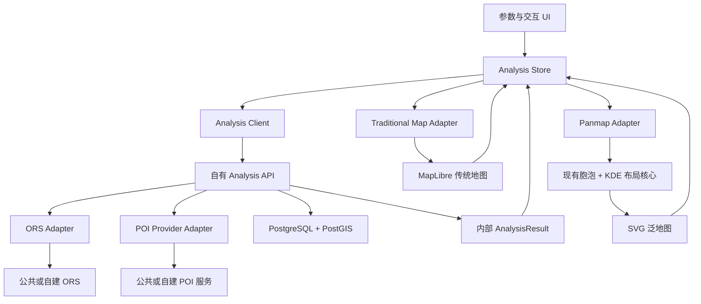

# ORS 迁移第 1 阶段：目标边界

## 1. 目标与约束

目标是在不重写现有泛地图的前提下，逐步建立可替换的 ORS/POI 服务、统一内部数据模型、PostGIS 空间数据中心和双视图联动。

以下约束为强约束：

- 前端只调用自有业务 API，不直接调用 ORS 或 POI 提供者。
- ORS Key 只存在于后端运行环境。
- ORS、POI 提供者的原始响应必须在后端 Adapter 中转换。
- 数据状态与视觉状态分离。
- 传统地图与泛地图通过稳定 ID 和统一状态中心联动，不直接相互调用。
- 现有泛地图算法优先包装和保留；传统地图按阶段渐进替换。

## 2. 目标模块边界

| 边界 | 目标职责 | 不应承担的职责 |
|---|---|---|
| 参数与交互 UI | 收集中心点、交通方式、阈值和类别；展示加载、错误和选择状态 | 直接请求 ORS、解释 ORS 响应、计算空间差集 |
| Analysis Store | 保存规范化数据状态和视觉状态；按 `poiId`、`ringId`、`categoryId` 派发选择/高亮 | 调用地图组件内部函数链、保存 API Key |
| Analysis Client | 调用自有 `/api/analyses` 等业务 API；处理取消、重试和错误映射 | 调用 ORS 公共 URL、把提供者结构暴露给视图 |
| Traditional Map Adapter | 把内部 `AnalysisResult` 映射为 MapLibre source/layer；把地图事件转换成稳定 ID | 直接控制泛地图、决定 POI 圈层归属 |
| Panmap Adapter | 把内部类别树和圈层结果转换为现有布局算法输入；把 SVG 事件转换成稳定 ID | 发起网络请求、持有 ORS 原始结构 |
| Panmap Layout Core | 父子胞泡排布、碰撞约束、密度采样、KDE 包络、布局审计 | 读取 DOM 表单、请求 API、管理全局选择状态 |
| Analysis API | 校验请求、编排等时圈/POI/矩阵流程、返回内部契约 | 返回未经转换的 ORS/POI 原始结构 |
| ORS Adapter | 管理 ORS Key、profile 映射、请求/错误/限流、响应标准化 | 被浏览器直接调用 |
| POI Provider Adapter | 查询和标准化 POI，映射稳定类别 | 把提供者特有字段渗透到视图 |
| PostGIS Repository | 存储 POI、分析任务、几何；修复多边形；构造互斥环带；空间索引和归属查询 | 控制前端视觉状态 |

## 3. 内部数据契约基线

第二阶段应先定义契约，再选择具体 API 和框架。至少包含：

```text
AnalysisRequest
├── center: { lon, lat, crs }
├── profile
├── rangesMinutes[]
├── categoryIds[]
└── options

AnalysisResult
├── analysisId
├── center
├── profile
├── cumulativeIsochrones[]
├── rings[]
├── pois[]
├── categories[]
└── metadata

Ring
├── ringId
├── rangeMinutes
├── innerRangeMinutes
├── geometry
└── statistics

Poi
├── poiId
├── location
├── categoryId
├── travelTimeSeconds
└── ringId

Category
├── categoryId
├── parentCategoryId
├── label
└── level
```

视觉属性如颜色、透明度、胞泡半径和当前高亮不进入 ORS Adapter 的数据结构；它们由前端主题和视觉状态派生。

## 4. 现有模块处理方式

### 4.1 保留

- `styles.css` 中泛地图视觉语言、圈层聚焦、类别高亮和画布交互样式；后续仅在必要时调整选择器边界。
- `panmap-layout.js` 中：
  - `seededRandom()`；
  - `clampToAnnulus()`；
  - `resolveCollisions()`；
  - `densitySamples()`；
  - `kdeContour()`；
  - `minimumGap()` 与 `contourClearance()`。
- `app.js` 中经过验证的泛地图缩放、手势模式、分栏比例和纯视觉交互，可在状态迁移后继续使用。

### 4.2 包装

- 把 `panmap-layout.js` 包装成“内部分析结果 → 布局节点/边界”的 Adapter，避免它继续持有业务静态数据。
- 把传统地图事件包装成 `poiId`、`ringId` 和坐标事件，即使初期仍使用静态 SVG。
- 把 `app.js` 的 DOM 事件包装成 Analysis Store action，逐步移除组件间直接查询 DOM 的逻辑。

### 4.3 渐进替换

- `index.html:211-261` 的 `svg.map-art`：在内部数据契约和 API 最小闭环稳定后替换为 MapLibre GL JS。
- `index.html:615-630` 的小窗 SVG：改为传统地图 Adapter 的第二视口或共享快照，不再维护另一份硬编码地图。
- `app.js:215-218`、`index.html:598-604` 和 `panmap-layout.js:7-105` 的重复静态统计/类别数据：由 `AnalysisResult` 单一来源替换。
- `app.js` 中以 DOM class 充当业务状态的逻辑：迁移到统一 Store，但保留 class 作为渲染结果。

### 4.4 新增

- 内部数据契约。
- Analysis Store。
- Analysis Client。
- 后端 Analysis API、ORS Adapter、POI Provider Adapter。
- PostgreSQL/PostGIS Repository。
- 错误模型、请求追踪和后续缓存接口。

## 5. 前端、后端、数据库和外部服务职责

### 5.1 前端

- 维护用户参数、分析结果缓存和视觉交互状态。
- 将内部 GeoJSON/POI 模型传给传统地图 Adapter。
- 将内部 ring/category/POI 汇总传给 Panmap Adapter。
- 通过统一 action 同步两个视图的选择、高亮和过滤。
- 不保存 ORS Key，不判断提供者错误码，不做正式空间差集。

### 5.2 自有后端

- 暴露稳定的 Analysis API。
- 校验中心点、profile、时间范围和类别。
- 调用 ORS/POI Adapter 并编排分析流程。
- 标准化数据、生成稳定 ID、记录来源和版本。
- 在 PostGIS 接入后负责几何有效性、互斥环带和空间归属。

### 5.3 PostgreSQL/PostGIS

- 保存分析任务、累计等时圈、互斥圈层、POI 和类别映射。
- 建立空间索引。
- 执行几何修复、差集、包含/相交和范围查询。
- 为实验复现保留请求参数、服务版本和结果元数据。

### 5.4 外部或自建服务

- ORS：只提供路网计算能力。
- POI Provider：只提供原始 POI 搜索/数据。
- 两者都必须通过后端 Adapter 访问，未来切换自建服务时不改变前端契约。

## 6. 目标数据流



## 7. 最小闭环迁移顺序

基于当前只有静态前端原型的现状，后续顺序建议为：

1. 定义 `AnalysisRequest`、`AnalysisResult`、`Ring`、`Poi`、`Category` 和统一错误模型。
2. 确认后端语言、部署方式和坐标系；在确认前不创建通用脚手架。
3. 建立最薄的自有 Analysis API 与 ORS Adapter，先返回规范化的累计等时圈。
4. 保持传统地图 SVG 可用，用 Adapter 把真实等时圈临时绘制到现有容器，验证前后端闭环。
5. 建立 POI Provider Adapter，返回带稳定 `poiId`/`categoryId` 的 POI。
6. 接入 Matrix，将 `travelTimeSeconds` 与 `ringId` 写入内部结果。
7. 引入 PostgreSQL/PostGIS，迁移几何修复、差集、空间归属和索引。
8. 建立 Analysis Store，使传统地图和泛地图消费同一结果。
9. 将传统地图内核渐进替换为 MapLibre GL JS。
10. 扩展缓存、异步任务、错误处理、大尺度 POI、自建 ORS/POI 和矢量瓦片。

调整原因：当前没有后端和真实数据，若先替换地图内核，会同时引入地图、API、数据和状态四类变量；先建立契约与最小 API 可把风险拆开。

## 8. 第 2 阶段建议改动范围

### 8.1 可准确执行的前端/契约范围

第二阶段建议仅触碰以下范围：

- 新增 `docs/ors-migration/03-internal-data-contracts.md`：冻结字段、ID、坐标系和错误模型。
- 新增 `src/contracts/analysis-contracts.js`：以 JSDoc typedef 或运行时校验描述内部契约；不引入依赖。
- 新增 `src/state/analysis-store.js`：最小可观察状态接口，区分数据状态和视觉状态。
- 新增 `src/adapters/panmap-layout-adapter.js`：把 `AnalysisResult` 转为当前 `panmap-layout.js` 所需的层/类别输入。
- 有限修改 `panmap-layout.js`：允许通过参数注入层数据，同时保留现有静态数据作为回退，避免页面行为变化。
- 有限修改 `app.js`：只接入 Store 的参数快照和视觉 action；不接 ORS。
- 有限修改 `index.html:647-648` 附近：仅登记新增脚本，禁止调整页面结构和视觉标记。
- 新增 `.gitignore` 与脱敏 `.env.example` 规范；前端示例中不得出现 ORS Key。

### 8.2 后端范围的前置决策

后端技术栈尚未确认，因此第二阶段在以下信息明确前不得创建 `server/` 工程：

- 运行语言与框架；
- 部署平台；
- 包管理器；
- 是否使用容器；
- 配置与密钥管理方式；
- API 测试策略。

确认后，第二阶段只建立 Analysis API、ORS Adapter 接口和配置加载骨架，不调用真实 ORS。

## 9. 第 2 阶段不得触碰的范围

- `index.html:11-646` 的布局、文字、SVG 图形和控件结构。
- `styles.css` 的颜色、排版、动画和交互视觉。
- 传统地图 SVG 的现有显示逻辑。
- `panmap-layout.js` 的碰撞、KDE、胞泡形状和边界视觉算法，除“输入参数化”外不得重写。
- 任何真实 ORS/POI URL、Key 或凭据。
- 数据库、迁移、Docker Compose 和生产部署。
- MapLibre、D3、Turf、状态库或后端框架依赖安装。
- 用户未跟踪的 `ORS地图服务重构_Codex执行文档_第1阶段.md`，除非用户明确要求纳入版本控制。

## 10. 主要风险与控制措施

| 风险 | 等级 | 控制措施 |
|---|---|---|
| 无后端技术栈却提前生成脚手架 | 高 | 第二阶段先完成决策检查点 |
| ORS 原始结构渗透前端 | 高 | 后端 Adapter + 内部契约 |
| Key 进入浏览器或提交记录 | 高 | 后端环境变量、`.gitignore`、密钥扫描 |
| UI 输入与静态布局继续脱节 | 高 | Analysis Store 和单一 `AnalysisRequest` |
| 传统地图和泛地图直接互调 | 高 | 稳定 ID + Store action |
| 现有泛地图算法在迁移中被重写 | 中 | 将算法核心包装为纯输入/输出边界 |
| 三处重复统计产生不一致 | 中 | `AnalysisResult` 单一数据源 |
| 同时替换地图和接入 API 难以回归 | 高 | 先最小 API 闭环，后替换 MapLibre |

