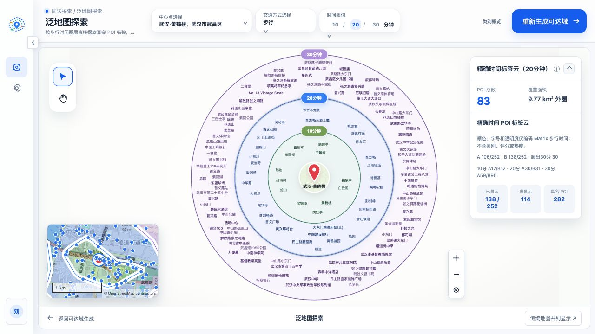
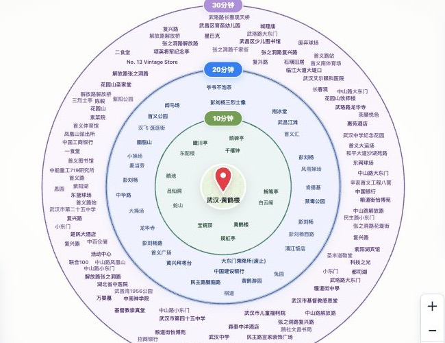
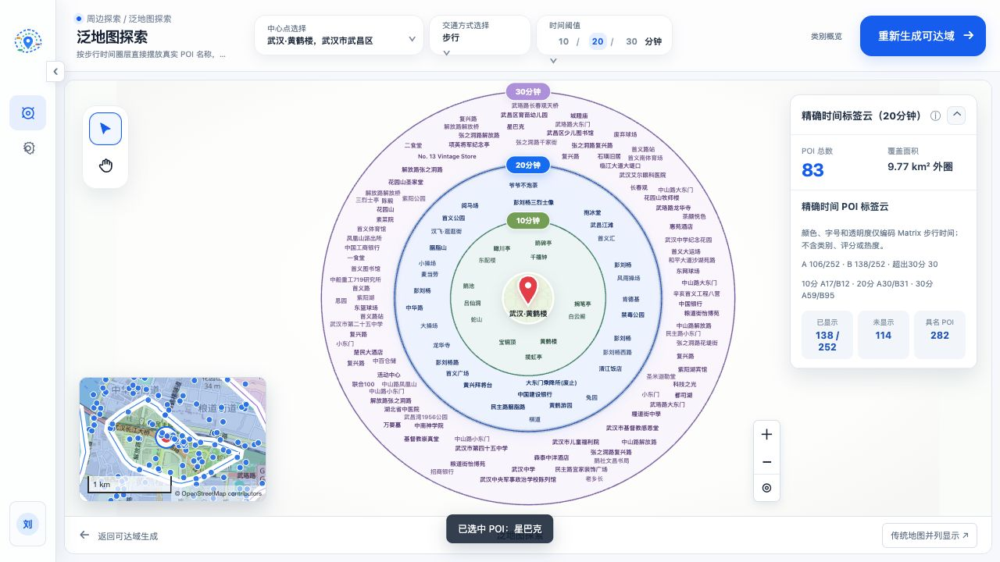
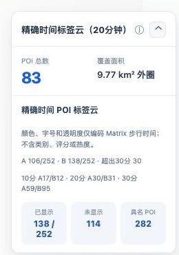

# 第 22 号报告：Stage 6 精确时间 POI 标签云布局

日期：2026-08-01  
执行范围：仅第 21 号文档  
真实上游 API 预算：0  
真实上游 API 实际调用：Isochrones 0、Geocoder 0、OpenPOIService 0、Matrix 0

## 1. 结论

第 21 阶段已完成。页面默认使用时间圈层约束的 sprite-board 布局 B，旧布局 A 仅保留为同输入研究基线。

- 第 20 号真实缓存仍是唯一数据基线：Matrix 合法结果 282/282；30 分钟内 eligible 252；10/20/30 分钟圈层为 39/83/130；`matrix-out-of-range` 30。
- A 与 B 都只在同一批 252 个 eligible POI 上运行；30 个 out-of-range 只计审计，不进入布局。
- A：106/252；B：138/252。B 多摆放 32 个，总摆放率由 42.06% 提升至 54.76%，提升 12.70 个百分点。
- 页面没有可见 POI 胶囊、矩形边框或圆角背景；实际 DOM 中 `.name-cloud-label-bg` 数量为 0。透明命中矩形只用于交互，不可见且不参与视觉编码。
- 5 次独立 B 复跑均得到 138/252 和相同稳定指纹 `fnv1a-8b0581ae`。
- 浏览器实际文字包围盒审计为 138 个标签、0 对重叠；布局引擎审计为 0 越界。
- 第 18 号 108/282 仅作为历史结果保留，未与 B 做直接比较。

## 2. 唯一缓存基线与零 API 证据

离线重建脚本 `scripts/rebuild_stage21_baseline.py` 为所有 HTTP 客户端注入了 `NoNetworkClient`；任何缓存缺失都会立即抛错，不会尝试真实网络。

| 项目 | 结果 |
|---|---:|
| Matrix 请求/合法 | 282 / 282 |
| eligible（≤1800 秒） | 252 |
| 10 / 20 / 30 分钟 | 39 / 83 / 130 |
| matrix-out-of-range | 30 |
| unreachable / invalid | 0 / 0 |
| 等时圈缓存 | hit |
| POI 缓存 | hit |
| Matrix 缓存 | hit |
| 本阶段上游请求 | 0 |

缓存标识：

- Matrix batch：`ors-matrix-c43f2e88afb746a60bd71ecf`
- ORS routing graph：`2026-07-28T19:03:26Z`
- Matrix 结果指纹：`5f969170a27089acbe6d4e59abf03d8cf3b56404de35c1370b9831b4c7203c6e`
- Matrix 响应 SHA-256：`ba14a06cfb779f1ecb8680d7368ba3983f9e61a20e5d5616976e598f844f5a34`
- 浏览器派生夹具：`exports/stage-6-layout/stage20-cache-baseline.json`
- 夹具 SHA-256：`c1ac3a837cf96bd576ad5ed6ac228be78d88da706c0c5db04d35194f14e4d51b`

浏览器验收页只读取上述本地 JSON，页面根节点同时记录 `data-stage21-upstream-requests="0"`。

## 3. 时间视觉编码

- eligible 条件：`matrixStatus=ok`、`0 ≤ travelTimeSeconds ≤ 1800`，且必须属于三个可见 Matrix band。
- 排序：`travelTimeSeconds` 升序，随后 `poiId` 升序。
- 字号：12–26px，`gamma=0.75`；字重 600；旋转 0°。
- 字色只取共享 ring token，不读取类别、评分或热度。
- 圈内透明度按时间线性下降；为满足小文字 WCAG AA，对文档初始远端 alpha 做同色相加深，浅色主题远端 alpha 为 0.72。
- 在白色最不利背景上的远端对比度：10 分钟 5.42:1、20 分钟 5.64:1、30 分钟 5.89:1，均高于 4.5:1。
- MapLibre Polygon 与泛地图共用 10/20/30 分钟 RGB token；传统 Polygon 填充透明度降为 0.16。

自动化测试确认视觉模型中不存在 `category`、`rating` 或 `heat` 字段，out-of-range 不会进入三圈标签数组。

## 4. 布局实现

布局 B 是项目内实现的小型 ring-constrained sprite-board 引擎，算法思路参考 d3-cloud，但未引入或声称使用完整 D3 库。

- Canvas 按真实字体、字号生成 glyph alpha sprite，并做 1px 安全膨胀。
- 三个圈层共享一个全局 `Uint8Array` 位图占用板。
- 中心锚点和三个时间芯片在放置前写入障碍物。
- 候选点使用固定黄金角螺线、固定种子族 0/1/2，不使用 `Math.random`。
- 每个候选的四角必须严格位于所属 annulus 内；字形位图必须与全局占用板不相交。
- 每个标签最多检查 1800 个候选；3 个变体按 placed、fill ratio、指纹稳定择优。
- 计算每约 8ms 主动让出事件循环；新任务会取消旧 job，旧 SVG 保留到新结果完整生成后再原子替换。
- 缓存键覆盖 POI 文本、时间、圈层、字号、透明度、颜色、画布尺寸、DPR、字体、padding、mask/seed/version。ResizeObserver 仅在实际尺寸变化后 200ms 重排；hover/select 不重排。
- SVG 最终只渲染水平文字；透明 hit rect 支持 `poiId` 选择联动。

## 5. A/B 同输入量化结果

### 5.1 三类守恒

| 布局 | placed | unplaced | out-of-range（仅审计） | eligible 守恒 |
|---|---:|---:|---:|---:|
| A | 106 | 146 | 30 | 106 + 146 = 252 |
| B | 138 | 114 | 30 | 138 + 114 = 252 |

`placed + unplaced + out-of-range = 282` 对 A、B 均成立。

### 5.2 分圈摆放率

| 圈层 | eligible | A placed | A 摆放率 | B placed | B 摆放率 |
|---|---:|---:|---:|---:|---:|
| 10 分钟 | 39 | 17 | 43.59% | 12 | 30.77% |
| 20 分钟 | 83 | 30 | 36.14% | 31 | 37.35% |
| 30 分钟 | 130 | 59 | 45.38% | 95 | 73.08% |
| 合计 | 252 | 106 | 42.06% | 138 | 54.76% |

10 分钟圈因最短时间标签按冻结规则使用最大字号，局部 placed 低于 A；B 的总体提升来自精确 glyph sprite 与外圈面积利用。没有为了提高数量缩小冻结字号。

### 5.3 重叠、越界、耗时与稳定性

| 指标 | A | B |
|---|---:|---:|
| 重叠 | 0 | 0 |
| 越界 | 0 | 0 |
| 稳定指纹 | `fnv1a-d8d4994f` | `fnv1a-8b0581ae` |
| 5 次 placed | 106/106/106/106/106 | 138/138/138/138/138 |
| 布局耗时 ms | 33.5 / 22.4 / 23.7 / 24.7 / 24.6 | 390.9 / 412.0 / 393.3 / 378.8 / 363.9 |
| 中位耗时 | 24.6ms | 390.9ms |
| B candidate checks | — | 213,984 |
| B fill ratio | — | 0.6977 |
| B 最大主线程分片 | — | 9.1 / 10.0 / 9.5 / 10.4 / 9.7ms |

B 的总耗时高于矩形 A，但仍低于 2 秒交互预算，并通过时间片将主线程连续占用控制在约 8–12ms。

三个 B 变体在代表性复跑中分别为：variant 1 = 138、variant 0 = 136、variant 2 = 131；选择 variant 1。

## 6. 双视图联动

点击 SVG 文字“星巴克”后：

- 标签获得 `.is-poi-selected`；
- 传统 MapLibre 图使用同一 `poiId=ors-poi:1:5980798687` 更新选中态；
- Matrix 详情显示 `21 分 39 秒`、路网距离 `1.80 千米`；
- 点击与 hover 仅更新样式和详情，不触发布局。

## 7. 截图

### 无胶囊全景

### 局部时间文字

### `poiId` 联动高亮

### A/B 指标

## 8. 验证记录

- `node --check panmap-layout.js`：通过。
- `node --check app.js`：通过。
- `node --test src/adapters/panmap-layout-adapter.test.js src/contracts/analysis-contracts.test.js src/map/analysis-poi-geojson.test.js`：8/8 通过。
- `git diff --check`：通过。
- 缓存离线重建断言：通过；网络客户端调用次数 0。
- 浏览器 5 次独立复跑：稳定。
- 浏览器 DOM：可见标签 138、`.name-cloud-label-bg` 0。
- 浏览器文字包围盒：重叠 0；布局约束审计：越界 0。
- 浏览器控制台未依赖 Mock、类别、评分或热度生成布局。

## 9. 本阶段实际修改/生成文件

- `app.js`
- `index.html`
- `panmap-layout.js`
- `styles.css`
- `src/config/ring-tokens.js`
- `src/adapters/panmap-layout-adapter.js`
- `src/adapters/panmap-layout-adapter.test.js`
- `src/adapters/traditional-map-adapter.js`
- `scripts/rebuild_stage21_baseline.py`
- `docs/ors-migration/21-stage-6-d3-time-label-cloud-execution.md`（原文归档）
- `docs/ors-migration/22-stage-6-d3-time-label-cloud-report.md`
- `exports/stage-6-layout/stage20-cache-baseline.json`
- `exports/stage-6-layout/stage21-no-capsule-panorama.png`
- `exports/stage-6-layout/stage21-local-time-text.png`
- `exports/stage-6-layout/stage21-linked-highlight.png`
- `exports/stage-6-layout/stage21-ab-metrics.png`

工作区内第 19/20 阶段以及更早的既有修改均未回退、覆盖或清理。
